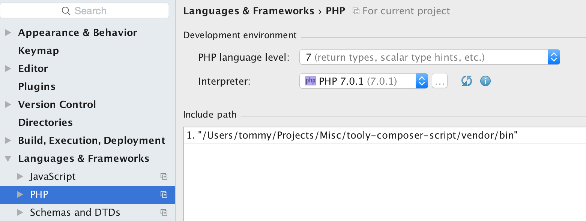

# tooly-composer-script

[](https://php.net/)
[](https://packagist.org/packages/tm/tooly-composer-script)
[](https://packagist.org/packages/tm/tooly-composer-script)
[](https://travis-ci.org/tommy-muehle/tooly-composer-script)
[](https://codeclimate.com/github/tommy-muehle/tooly-composer-script)
[](https://codeclimate.com/github/tommy-muehle/tooly-composer-script/coverage)
[](https://insight.sensiolabs.com/projects/d895d331-4322-4708-8924-d80c32d3fb17)
[](https://packagist.org/packages/tm/tooly-composer-script)
[](https://gitter.im/tommy-muehle/tooly-composer-script?utm_source=badge&utm_medium=badge&utm_campaign=pr-badge)

With tooly [composer-script](https://getcomposer.org/doc/articles/scripts.md) you can version needed PHAR files in your project's composer.json without adding them directly to a VCS, 
* to save disk space at vcs repository
* to be sure that all developers in your project get the required toolchain
* to prepare a CI/CD System
* (optional) to automatically check the [GPG signature verification](https://www.gnupg.org/gph/en/manual/x135.html) for each tool 

Every PHAR file will be saved in the [composer binary directory](https://getcomposer.org/doc/articles/vendor-binaries.md). 

## Example

An real example can be found [here](composer.json#L57-L76).

## Requirements

* PHP >= 5.6
* Composer
 
## Install

To use the script execute the following command:

```
composer require --dev tm/tooly-composer-script
```

Then add the script in the composer.json under *"scripts"* with the event names you want to trigger.
For example:

```
...
"scripts": {
    "post-install-cmd": "Tooly\\ScriptHandler::installPharTools",
    "post-update-cmd": "Tooly\\ScriptHandler::installPharTools"
  },
...
```

Look [here](https://getcomposer.org/doc/articles/scripts.md#event-names) for more informations about composer events.

## Sample usage

The composer.json scheme has a part "extra" which is used for the script.
Its described [here](https://getcomposer.org/doc/04-schema.md#extra).

In this part you can add your needed phar tools under the key "tools".

```
...
"extra": {
    ...
    "tools": {
      "phpunit": {
        "url": "https://phar.phpunit.de/phpunit-5.5.0.phar",
        "sign-url": "https://phar.phpunit.de/phpunit-5.5.0.phar.asc"
      },
      "phpcpd": {
        "url": "https://phar.phpunit.de/phpcpd-2.0.4.phar",
        "only-dev": true
      },
      "security-checker": {
        "url": "http://get.sensiolabs.org/security-checker.phar",
        "force-replace": true
      },
    }
    ...
  }
...
```

## Parameters

### url (required)

After you add the name of the tool as key, you need only one further parameter. The *"url"*.
The url can be a link to a specific version, such as x.y.z, or a link to the latest version for this phar.

### sign-url (optional, default none)

If this parameter is set tooly checks if the PHAR file in url has a valid signature by 
comparing signature in sign-url.

This option is useful if you want to be sure that the tool is from the expected author. 

*Note: For the check you need a further [requirement](https://packagist.org/packages/tm/gpg-verifier) and a GPG binary in your $PATH variable.*
 
You can add the requirement with this command:
```composer require tm/gpg-verifier```

This check often fails if you dont has the public key from the tool author 
in your GPG keychain. 

### force-replace (optional, default false)

Every time you update or install with composer the phar tools are checked. You are asked if you want to overwrite
the existing phar if the remote and local phar has not the same checksum.

Except you set this parameter. 

This option is useful if you has a link to the latest version of a tool and always want a replacement.
Or you run composer in non-interactive mode (for example in a CI system) and want a replacement.

But is also useful if some require-dev library has one of the tools as own requirement.
 
### only-dev (optional, default true)

This parameter means that this phar is only needed in developing mode.
So the command ```composer [install|update] --no-dev``` ignores this phar tool.

**Note: Therefore tooly must be a [no-dev requirement](https://getcomposer.org/doc/04-schema.md#require)** 

## Postcardware

You're free to use this package (it's [MIT-licensed](LICENSE)), but if it makes you happy it would be a great pleasure for me if you send a postcard from your hometown to me.
My address is: Tommy Muehle, Hepkestr. 177, 01277 Dresden, Germany.

The postcards will get published on [my website](https://tommy-muehle.io).

## A note to PhpStorm or other IDE users

To furthermore have auto-suggestion you should set the "include_path" option in the project.


## Contributing

Please refer to [CONTRIBUTING.md](CONTRIBUTING.md) for information on how to contribute.
